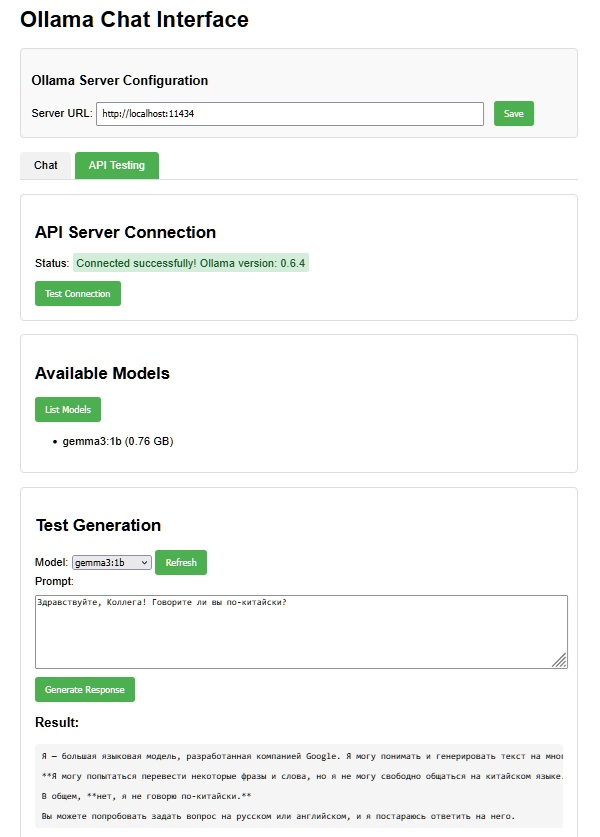

# Ollama API Checker (ollama-api-cheker)

Инструмент для тестирования и взаимодействия с API серверов Ollama через удобный веб-интерфейс. Проект состоит из Node.js прокси-сервера и HTML-страницы для тестирования различных конечных точек API Ollama.



## Описание проекта

Ollama API Checker предоставляет пользовательский интерфейс для взаимодействия с Ollama API, позволяя:

- Тестировать соединение с серверами Ollama
- Просматривать список доступных моделей
- Генерировать тексты используя выбранную модель
- Взаимодействовать с моделями через чат-интерфейс

## Особенности

- **Прокси-сервер**: Решает проблемы CORS при обращении к API Ollama из браузера
- **Настраиваемый URL API**: Возможность подключения к серверам Ollama на разных хостах
- **Два режима работы**:
  - **Чат**: Интерактивный чат с AI-моделями
  - **API тестирование**: Прямое тестирование API-вызовов
- **Темная/Светлая тема**: Поддержка как темной, так и светлой темы пользовательского интерфейса
- **Обработка потоковых ответов**: Правильная обработка потоковых JSON-ответов от API Ollama


## Технические детали

### Структура проекта

- `server.js` - Прокси-сервер на Node.js
- `ollama-test.html` - HTML страница с пользовательским интерфейсом
- `README.md` - Документация проекта

### Принцип работы

1. Node.js сервер запускается на порте 3000
2. Запросы с префиксом `/api/` проксируются на сервер Ollama (по умолчанию http://localhost:11434)
3. Для конечной точки `/api/generate` обрабатываются потоковые ответы и собираются в единый ответ
4. Веб-страница предоставляет графический интерфейс для взаимодействия с API

### API Endpoints

Поддерживаются следующие конечные точки API:
- `/api/version` - Проверка версии Ollama
- `/api/tags` - Получение списка доступных моделей
- `/api/generate` - Генерация текста с помощью выбранной модели

## Запуск

1. Установите Ollama на локальной машине или на удаленном сервере
2. Клонируйте этот репозиторий
3. Запустите Node.js сервер:
```bash
node server.js
```
4. Откройте браузер и перейдите по адресу: http://localhost:3000

## Настройка

По умолчанию проект настроен на работу с Ollama API по адресу http://localhost:11434, но вы можете изменить URL в интерфейсе приложения.

## Требования

- Node.js
- Работающий сервер Ollama
