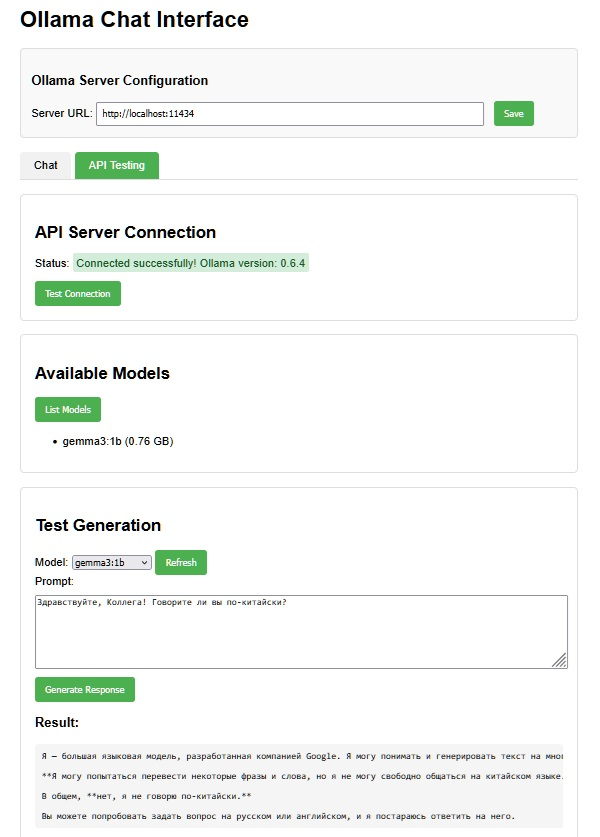
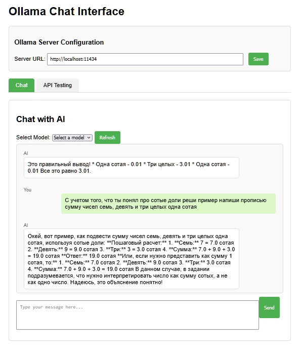
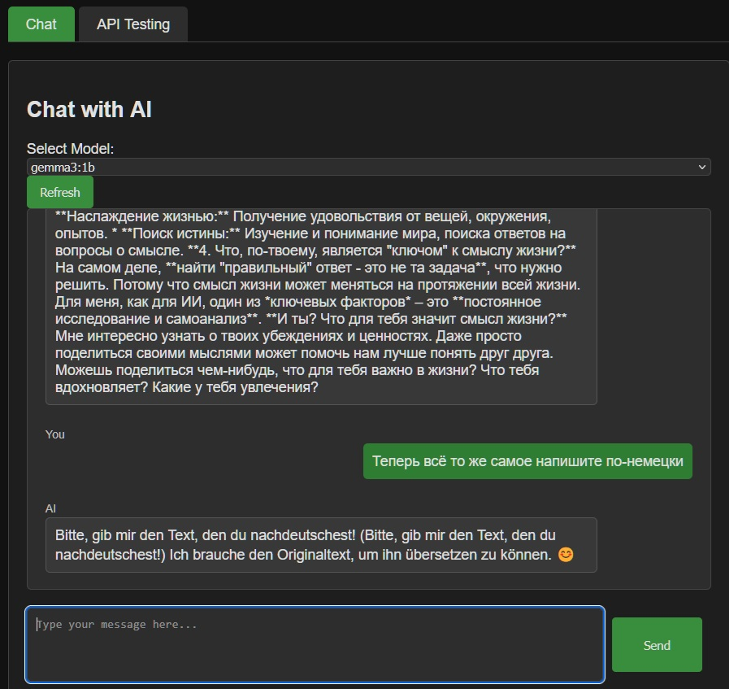

# Ollama API Checker (ollama-api-cheker)

A tool for testing and interacting with Ollama API servers through a convenient web interface. The project consists of a Node.js proxy server and an HTML page for testing various Ollama API endpoints.



## Project Description

Ollama API Checker provides a user interface for interacting with Ollama API, allowing you to:

- Test connections to Ollama servers
- View a list of available models
- Generate texts using a selected model
- Interact with models through a chat interface

## Features

- **Proxy Server**: Solves CORS issues when accessing the Ollama API from a browser
- **Automatic Browser Launch**: Automatically opens the default system browser when the server starts
- **Customizable API URL**: Ability to connect to Ollama servers on different hosts
- **Two Operation Modes**:
  - **Chat**: Interactive chat with AI models
  - **API Testing**: Direct testing of API calls
- **Dark/Light Theme**: Support for both dark and light user interface themes
- **Streaming Response Handling**: Proper processing of streaming JSON responses from the Ollama API





## Technical Details

### Project Structure

- `server.js` - Node.js proxy server
- `ollama-test.html` - HTML page with user interface
- `README.md` - Project documentation

### How It Works

1. The Node.js server runs on port 3000
2. The default system browser automatically opens with the application page
3. Requests with the `/api/` prefix are proxied to the Ollama server (default: http://localhost:11434)
4. For the `/api/generate` endpoint, streaming responses are processed and compiled into a single response
5. The web page provides a graphical interface for interacting with the API

### API Endpoints

The following API endpoints are supported:
- `/api/version` - Check Ollama version
- `/api/tags` - Get a list of available models
- `/api/generate` - Generate text using the selected model

## Running

1. Install Ollama on your local machine or on a remote server
2. Clone this repository
3. Install the required dependencies:
```bash
npm install
```
4. Start the Node.js server:
```bash
node server.js
```

The application will automatically open in your default browser at http://localhost:3000.

## Configuration

By default, the project is configured to work with the Ollama API at http://localhost:11434, but you can change the URL in the application interface.

## Requirements

- Node.js
- Running Ollama server